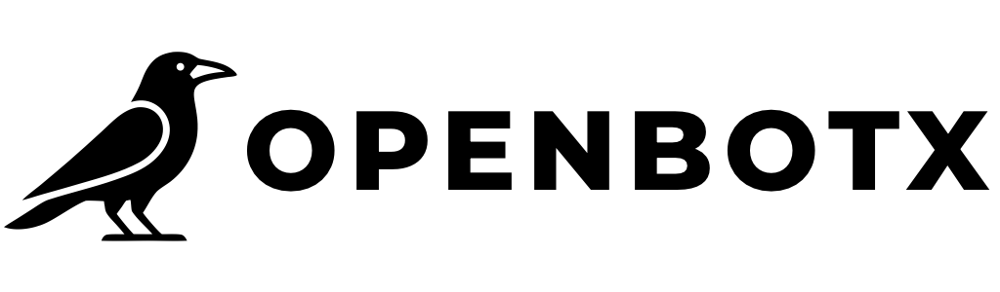

<p align="center">
    <a href="https://openbotx-marketplace.pages.dev" target="_blank" rel="noopener noreferrer">
        
    </a>
    <br>
    <br>
    Skills marketplace for the OpenBotX project.
    <br>
</p>

<br>

# OpenBotX Marketplace

This repository contains the source code for the [OpenBotX Marketplace](https://openbotx-marketplace.pages.dev) — a platform to discover, search, and download skills for OpenBotX AI assistants.

Built with [Kaktos](https://github.com/paulocoutinhox/kaktos), a Python static site generator.

## Requirements

- Python 3.9+
- Git (for importing skills from external sources)

## Commands

### Import skills

Clones external repositories defined in `sources.yml` and copies their skills into the local `skills/` directory:

```bash
python3 kaktos.py import
```

### Build site

Generates the static site in the `build` folder:

```bash
python3 kaktos.py build
```

### Generate skills data

Generates `index.json`, `package.zip`, and copies `SKILL.md`/`LICENSE` for each skill into the `build` folder:

```bash
python3 kaktos.py gen
```

### Development server

Starts a local development server with live reload:

```bash
python3 -m venv venv
source venv/bin/activate
pip install -r requirements.txt
python3 kaktos.py
```

## Full build pipeline

```bash
python3 kaktos.py import
python3 kaktos.py build
python3 kaktos.py gen
```

## License

[MIT](http://opensource.org/licenses/MIT)

Copyright (c) 2026, Paulo Coutinho
